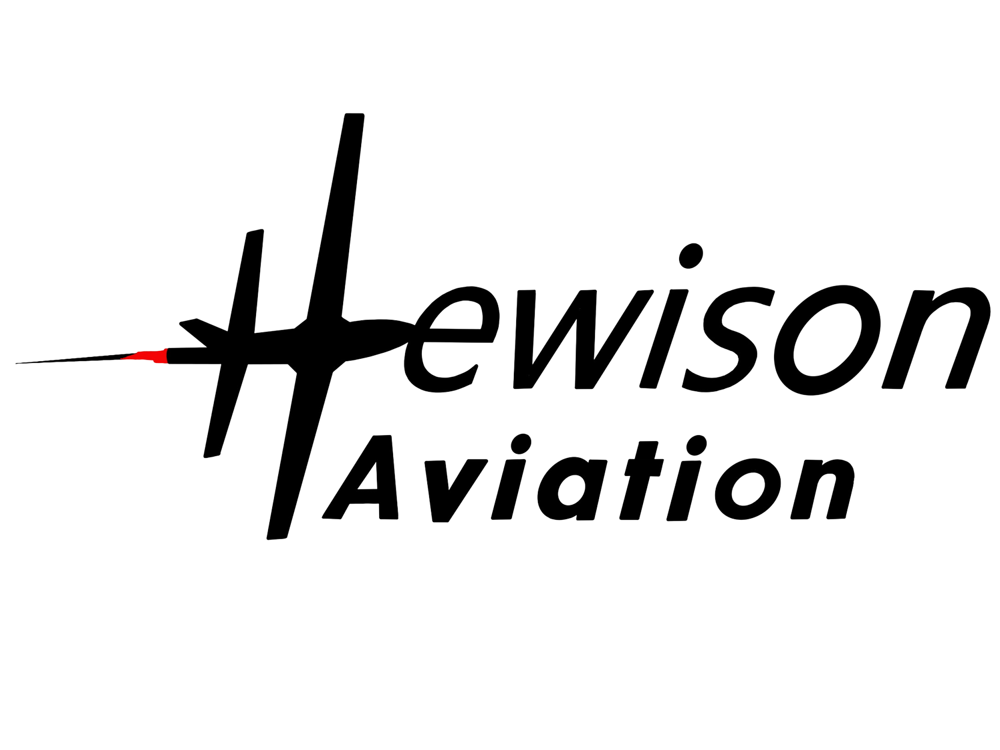
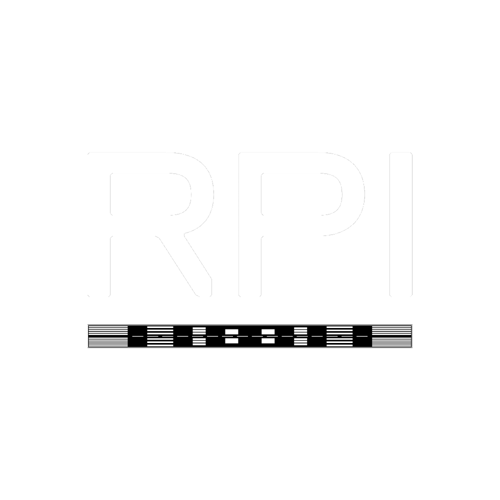

<head>
  <link rel="icon" type="image/png" href="assets/RFC_icon.png">
</head>

<nav class="top-nav">
  
  

    <a href="/about" class="nav-item">About</a>
    <a href="/ground-school" class="nav-item">Ground School</a>
    <a href="#events" class="nav-item">Events</a>
    <a href="/calendar" class="nav-item">Calendar</a>
    <a href="/join" class="nav-item nav-btn-special">Join Us</a>
  

</nav>

<header class="hero-section">
  
  <h1 class="hero-title">YOUR JOURNEY STARTS HERE</h1>
  
Advancing Aviation at Rensselaer

</header>

  
  

    

      <h4 style="margin: 0; color: #888; text-transform: uppercase; letter-spacing: 1px;">Training Partner</h4>
      
Partnering with local flight schools to get you in the air.

    

    
  

  

    <h2 style="font-size: 3rem; font-weight: 800;">Join the community.</h2>
    

      From ground school to fly-ins, the RPI Flying Club provides the wings for your ambition.
    

  

  <h2 id="events" style="font-weight: 800; font-size: 2rem;">Latest Events</h2>
  

    
    
    
  

  <h2 style="text-align: center; font-size: 2.5rem; font-weight: 800; margin-top: 100px;">Our Leadership</h2>
  

    
<strong style="color: var(--rpi-red); font-size: 1.3rem;">Andreas</strong> <small>President</small>

    
<strong style="color: var(--rpi-red); font-size: 1.3rem;">Jordan</strong> <small>Vice President</small>

    
<strong style="color: var(--rpi-red); font-size: 1.3rem;">Shane</strong> <small>Treasurer</small>

    
<strong style="color: var(--rpi-red); font-size: 1.3rem;">Stella</strong> <small>Secretary</small>

    
<strong style="color: var(--rpi-red); font-size: 1.3rem;">Matthew</strong> <small>Safety Officer</small>

  

  

    
  

  <footer style="margin-top: 100px; text-align: center; border-top: 1px solid #eee; padding-top: 50px; color: #bbb;">
    
Rensselaer Union, Troy, NY | rpiflying@gmail.com

    
© 2026 RPI Flying Club

  </footer>

