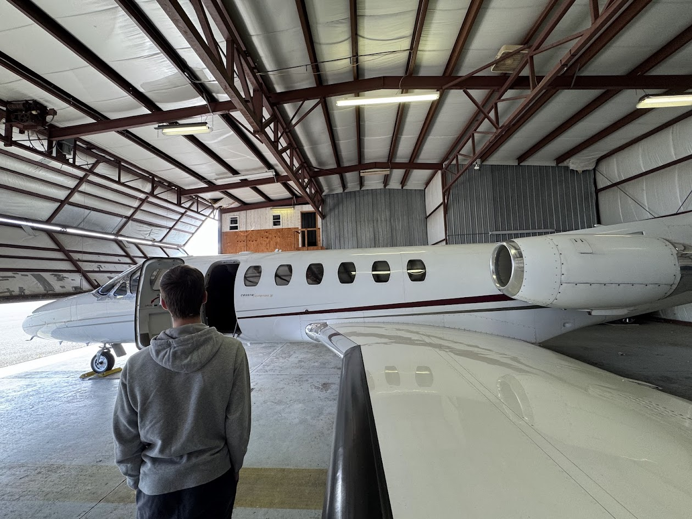

<head>
  <link rel="icon" type="image/png" href="assets/RFC_icon.png">
  <link href="https://fonts.googleapis.com/css2?family=Notable&display=swap" rel="stylesheet">
</head>

<nav class="top-nav">
  
  

    <a href="/about" class="nav-item">About</a>
    <a href="/ground-school" class="nav-item">Ground School</a>
    <a href="/officer-team" class="nav-item">Officers</a>
    <a href="/calendar" class="nav-item">Calendar</a>
    <a href="/join" class="nav-item" style="background: var(--rfc-red); color: white; border-radius: 4px;">Join Us</a>
  

</nav>

  
  <h1 class="hero-title">YOUR JOURNEY STARTS HERE</h1>
  
RPI FLYING CLUB

  
  

    <h2>Advancing Aviation at RPI</h2>
    

      Students, Pilots, Engineers, Nerds. We are the community for all aviation enthusiasts at Rensselaer. We provide the resources, networking, and environment to jumpstart your aviation journey.
    

  

  

    

      <h2 style="font-family: 'Notable', sans-serif; color: var(--rfc-blue); margin: 0; line-height: 1.1;">AWARD WINNING BRAND</h2>
      
Winner of the RPI Brand Competition. Designed to reflect the speed and precision of aviation. Our identity is built to represent the future of flight on campus.

      Logo designed by Kaden Tennent, Ex-President '23-'25
    

    
  

  

    <h2 class="gallery-title">Life at RFC</h2>
    

      
      
      
      
    

  

  <footer style="text-align: center; padding: 6rem 0; margin-top: 8rem; border-top: 3px solid var(--rfc-gold); color: var(--rfc-blue); width: 100%;">
    
    
© 2026 RPI Flying Club. All rights reserved.

  </footer>

