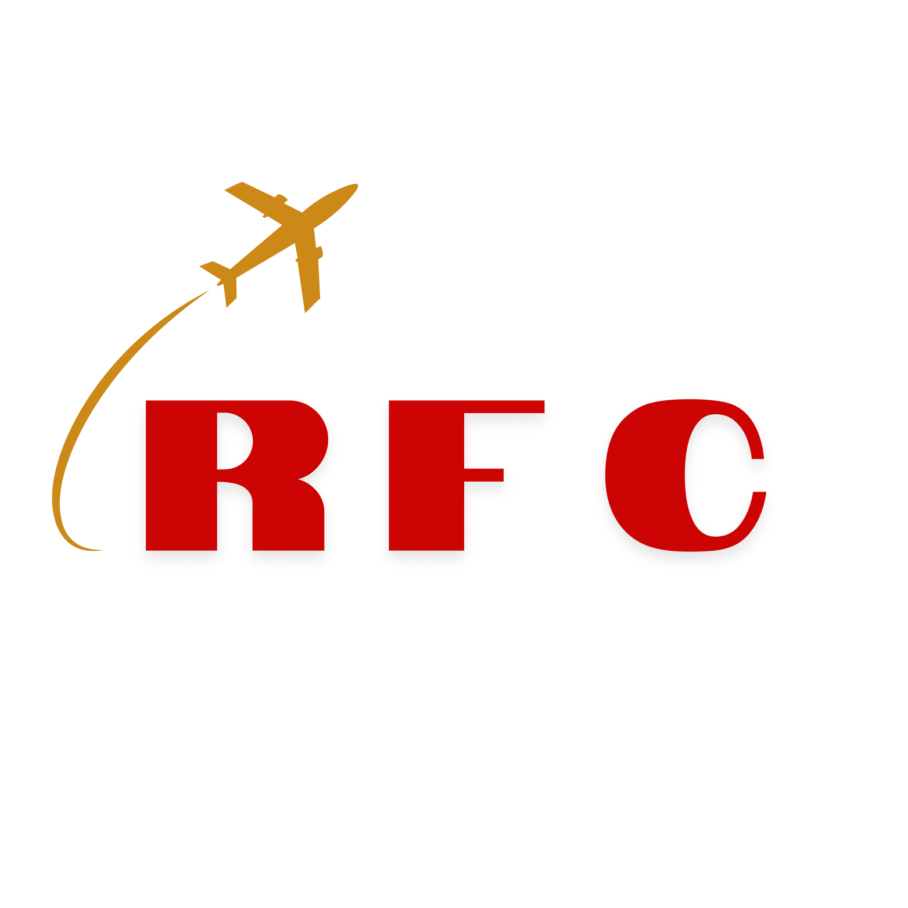
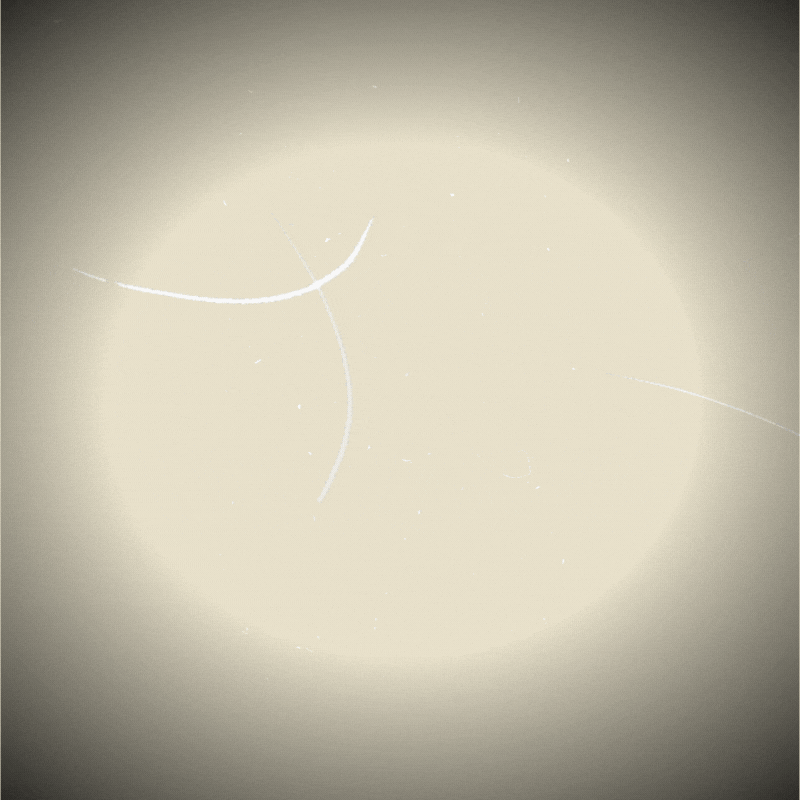
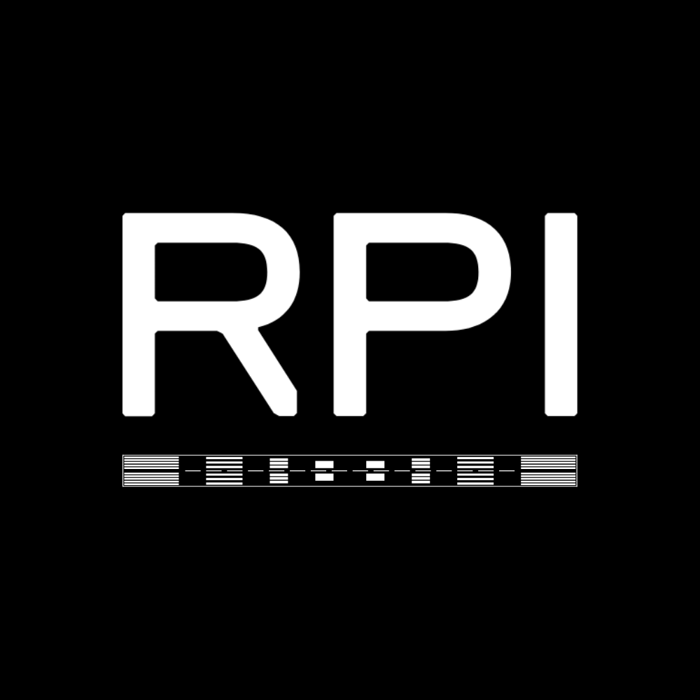
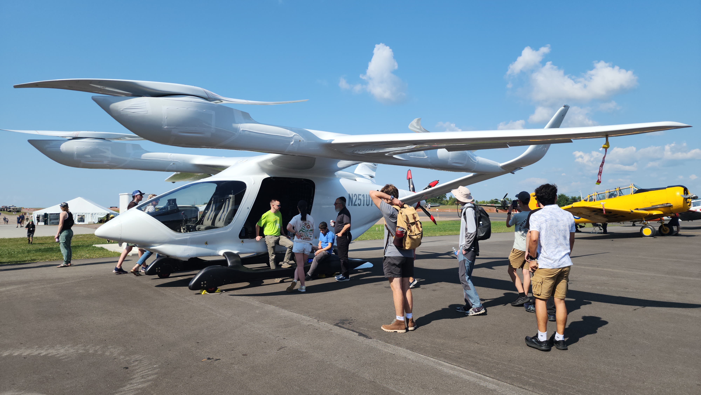

<head>
  <link rel="icon" type="image/png" href="assets/RFC_icon.png">
</head>

<nav class="top-nav">
  
  

    <a href="/about" class="nav-item">About</a>
    <a href="/ground-school" class="nav-item">Ground School</a>
    <a href="/officer-team" class="nav-item">Officers</a>
    <a href="/calendar" class="nav-item">Calendar</a>
    <a href="/join" class="nav-item nav-btn-join">Join Us</a>
  

</nav>

  
  <h1 class="hero-title">YOUR JOURNEY STARTS HERE</h1>
  
RPI FLYING CLUB

  
  

    

      <h2 style="font-size: 2.5rem; font-weight: 900; margin: 0;">AWARD WINNING BRAND</h2>
      
Winner of the RPI Brand Competition. Our identity reflects the speed and precision of aviation.

      Logo designed by Kaden Tennent, Ex-President '23-'25
    

    
  

  

    <h2 style="font-size: 3.5rem; font-weight: 800; letter-spacing: -2px;">Advancing Aviation at RPI</h2>
    

      The RPI Flying Club is a student-run organization dedicated to making flight accessible to the RPI community.
    

  

  

    
    
    
  

  <footer style="text-align: center; padding-top: 100px; margin-top: 100px; border-top: 1px solid #eee; color: #bbb;">
    
    
Rensselaer Union, Troy, NY | rpiflying@gmail.com

    
© 2026 RPI Flying Club

  </footer>

