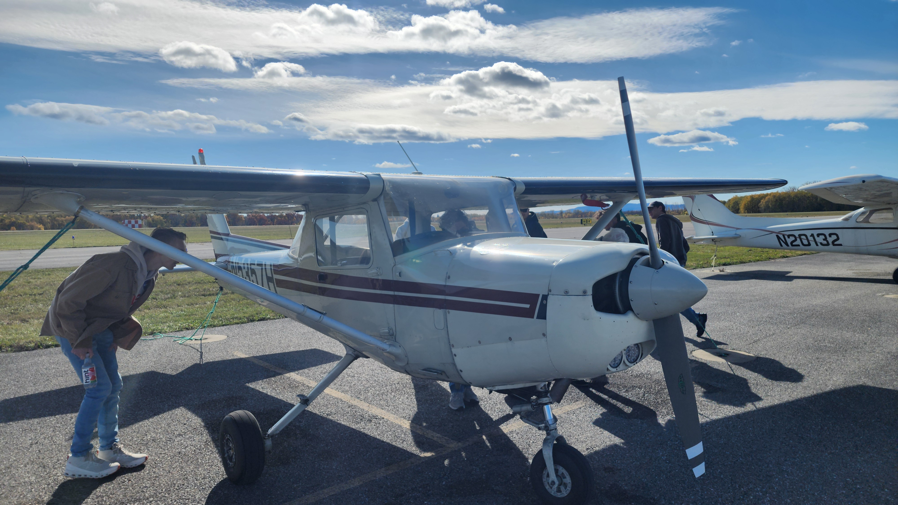
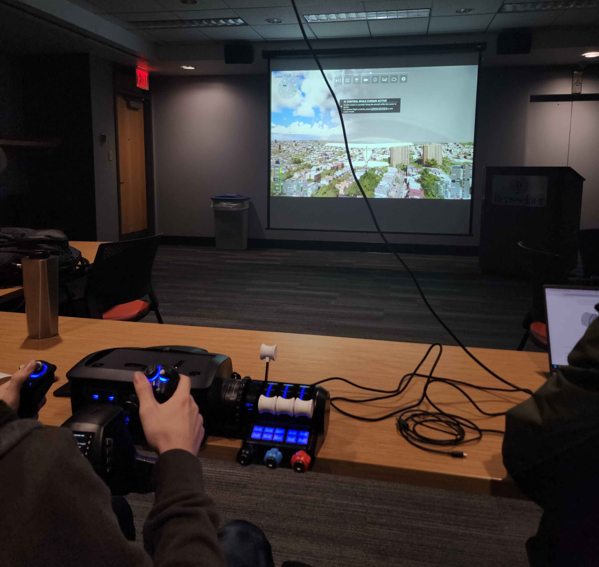

  

  <h1 style="font-weight: 700; color: #111;">Your Journey Starts Here</h1>
  

    Pilot? Planespotter? Aviation enthusiast? [cite: 8, 9] We are the club for you. [cite: 13, 15] 
    Advancing aviation at Rensselaer by making flight accessible to everyone.
  

  <a href="/join" class="btn-join">Become a Member Today</a>

<h2 class="section-title">Member Benefits</h2>

  

    <h3 style="color: #D6001C;">$30 / Semester</h3>
    
Or save with $50 for the full year! [cite: 19, 21, 22]

    <ul class="benefit-list">
      <li>Access to all club meetings, trips, & events [cite: 24, 25]</li>
      <li>Discounted trip fees [cite: 26]</li>
      <li>Free food & snacks at Social Nights [cite: 28, 29]</li>
      <li>Complimentary RFC stickers (Coming Soon) [cite: 31, 32]</li>
    </ul>
  

  

    <h3 style="color: #D6001C;">Career & Connections</h3>
    
Gain access to alumni at top companies: [cite: 38, 39]

    

      BOEING | DELTA | LOCKHEED MARTIN | PRATT & WHITNEY 
    

  

<h2 class="section-title">Our Leadership</h2>

  [cite_start]
AndreasPresident
 [cite: 58]
  [cite_start]
JordanVice President
 [cite: 61, 62]
  [cite_start]
ShaneTreasurer
 [cite: 63]
  [cite_start]
StellaSecretary
 [cite: 69]
  [cite_start]
MatthewFlight Safety
 [cite: 59, 60]

<h2 class="section-title">Gallery</h2>

  
  
  

  
Location: Rensselaer Union, Troy, NY | [cite_start]<a href="mailto:rpiflying@gmail.com">rpiflying@gmail.com</a>
 [cite: 44]
  
© 2026 RPI Flying Club. [cite_start]All rights reserved.
 [cite: 66, 67]

